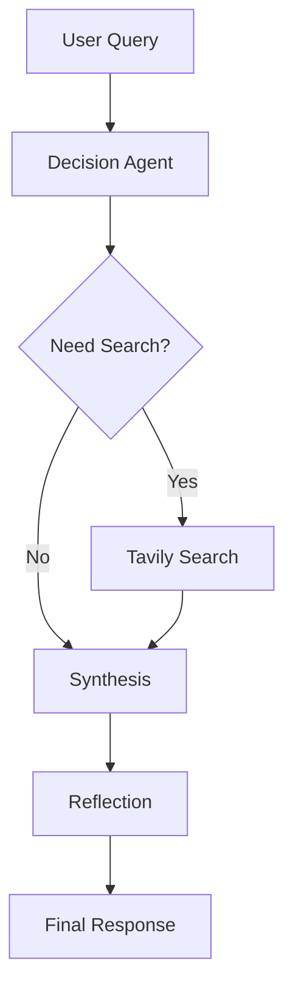

# ResearchScout AI

Agentic Learning and Research Assistant for AI/ML Students

## Features

- Multi-stage Agent Workflow
  - Observe
  - Reason
  - Decide
  - Act
  - Reflect
  - Respond

- Dynamic Search Routing
- Tavily Web Search
- DeepSeek LLM Integration
- Reflection & Self-Correction
- Streamlit Interface

## Architecture

## Installation

pip install -r requirements.txt

## Environment Variables

Copy:

.env.example

to

.env

and fill in:

DEEPSEEK_API_KEY=
TAVILY_API_KEY=

## Run

streamlit run app.py
