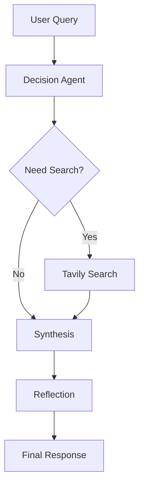
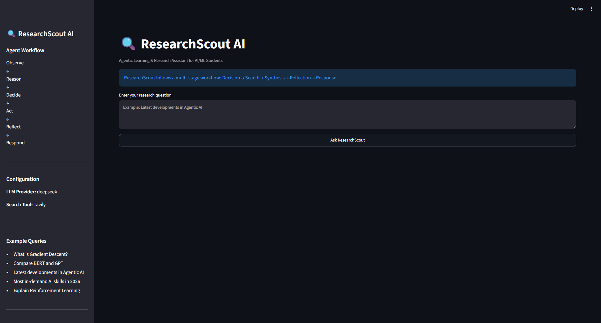
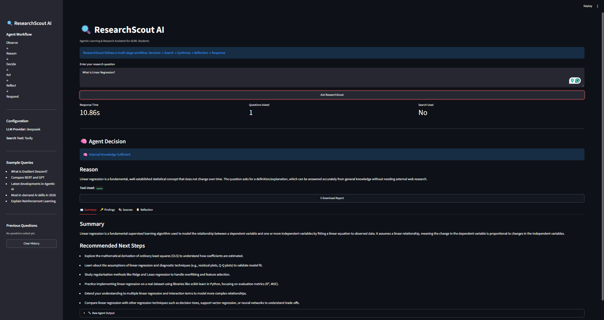
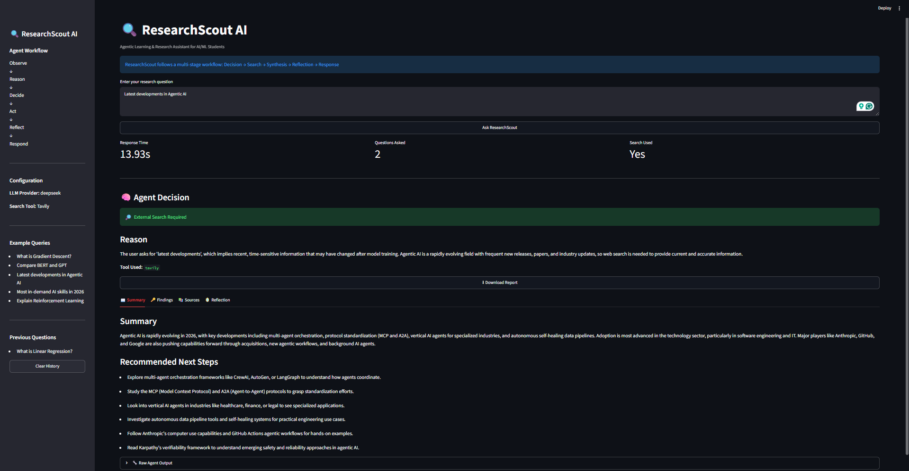
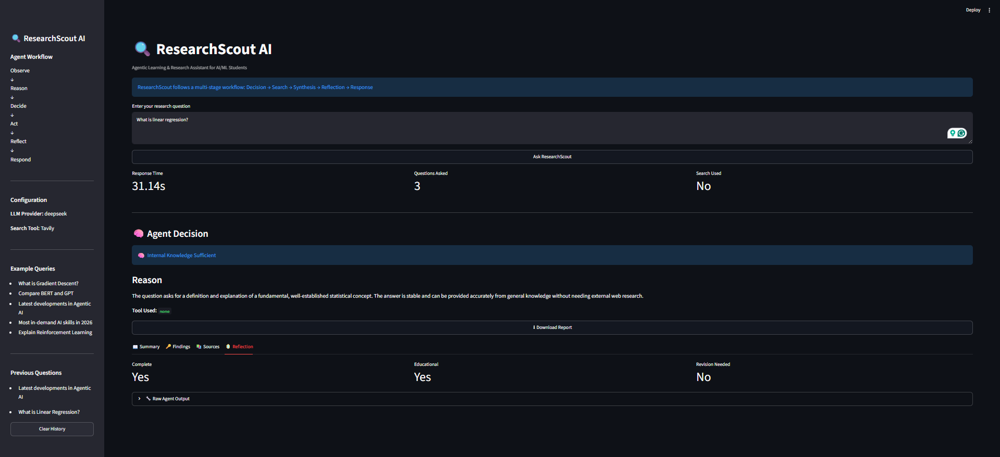

# 🔍 ResearchScout AI


> Agentic Learning and Research Assistant for AI/ML Students

---

## 🚀 Live Demo

Try ResearchScout AI directly in your browser:

🔗 **Live Application:** https://researchscout-ai.streamlit.app/

No installation required. Simply open the app, enter a research question, and ResearchScout will determine whether the query can be answered from internal knowledge or requires external web search.

### Example Queries

```text
What is Linear Regression?

Explain Gradient Descent

Compare BERT and GPT

Latest developments in Agentic AI

Most in-demand AI skills in 2026
```

---

## Why ResearchScout?

Most educational AI assistants either rely entirely on an LLM's internal knowledge or perform web searches for every query.

ResearchScout introduces an intelligent decision layer that determines whether external search is actually required before generating a response.

This approach:

- Reduces unnecessary search calls
- Improves response speed
- Lowers operational costs
- Preserves answer quality for foundational topics
- Retrieves current information when necessary

In addition, every response passes through a reflection stage that evaluates completeness, educational value, and source usage before delivering the final answer.

---

## 🚀 Features

### 🧠 Multi-Agent Research Workflow

ResearchScout follows a structured agent workflow:

- Observe
- Reason
- Decide
- Act
- Reflect
- Respond

### 🔍 Dynamic Search Routing

Automatically determines whether a query can be answered from internal knowledge or requires external web search.

### 🌐 Tavily Web Search Integration

Retrieves up-to-date information for:

- Recent developments
- Industry trends
- Research breakthroughs
- Time-sensitive topics

### 🤖 DeepSeek LLM Integration

Uses DeepSeek as the reasoning and response generation engine.

### 🪞 Reflection & Self-Correction

Every response is evaluated for:

- Completeness
- Educational value
- Source usage
- Need for revision

### 📚 Structured Educational Responses

Responses include:

- Summary
- Key Findings
- Recommended Next Steps
- Sources
- Reflection Metrics

### 🎨 Streamlit User Interface

Interactive research dashboard built with Streamlit.

---

## 🏗️ Architecture



---

## 🖼️ Screenshots

### Dashboard



ResearchScout AI's main interface, showing the agent workflow, configuration panel, example queries, and research input area.

---

### Internal Knowledge Query



Example query: **"What is Linear Regression?"**

ResearchScout identifies this as a stable, foundational concept and answers directly using internal reasoning without invoking external search.

---

### External Search Query



Example query: **"Latest developments in Agentic AI"**

ResearchScout determines that the query requires current information and automatically triggers Tavily web search.

---

### Reflection Layer



ResearchScout evaluates every generated response through a reflection stage. The system checks for completeness, educational value, source usage, and whether revision is required before delivering the final answer.

---

## 🛠️ Tech Stack

| Component | Technology |
|------------|------------|
| Frontend | Streamlit |
| Backend | Python |
| LLM | DeepSeek |
| Search Engine | Tavily |
| Validation | Pydantic |
| Environment Management | Python Dotenv |
| Version Control | Git & GitHub |

---

## ⚙️ Installation

### Clone the Repository

```bash
git clone https://github.com/divyabhanu-rana/researchscout-ai.git

cd researchscout-ai
```

### Create a Virtual Environment

```bash
python -m venv venv
```

### Activate the Environment

#### Windows

```bash
venv\Scripts\activate
```

#### Linux / macOS

```bash
source venv/bin/activate
```

### Install Dependencies

```bash
pip install -r requirements.txt
```

---

## 🔑 Environment Variables

Copy:

```text
.env.example
```

to:

```text
.env
```

and fill in your API keys:

```env
DEEPSEEK_API_KEY=

TAVILY_API_KEY=

LLM_PROVIDER=deepseek

DEEPSEEK_MODEL=deepseek-chat

DEEPSEEK_BASE_URL=https://api.deepseek.com

MAX_SEARCH_RESULTS=5

LLM_MAX_RETRIES=1

REQUEST_TIMEOUT_S=45
```

---

## ▶️ Running the Application

```bash
streamlit run app.py
```

The application will be available at:

```text
http://localhost:8501
```

---

## 🔄 Agent Workflow

### 1. Observe

Receives and interprets the user's query.

### 2. Reason

Analyzes the query and determines the information requirements.

### 3. Decide

Determines whether the answer requires external search.

### 4. Act

Uses Tavily Search when external information is needed.

### 5. Reflect

Evaluates the generated response for quality and educational value.

### 6. Respond

Returns a structured final answer.

---

## 📊 Example Queries

```text
What is Gradient Descent?

Compare BERT and GPT

Latest developments in Agentic AI

Most in-demand AI skills in 2026

Explain Reinforcement Learning

How does Retrieval-Augmented Generation work?
```

---

## 🎯 Project Goals

ResearchScout AI aims to:

- Improve learning outcomes for AI/ML students
- Deliver research-backed educational responses
- Demonstrate agentic AI workflows
- Explore self-reflective AI systems
- Encourage structured reasoning and learning

---

## 🔮 Future Improvements

- PDF research paper ingestion
- ArXiv integration
- Automatic citation generation
- Session memory
- Multi-agent collaboration
- Vector database integration
- Research report export (PDF)
- Learning roadmap generation
- Personalized study recommendations

---

## 📁 Project Structure

```text
researchscout-ai/
│
├── app.py
├── agent.py
├── tools.py
├── prompts.py
├── models.py
├── config.py
├── cli.py
├── requirements.txt
├── .env.example
├── screenshots/
└── README.md
```

---

## 👨‍💻 Author

**Divyabhanu Rana**

Junior, Data Science & Artificial Intelligence

---

## ⭐ Acknowledgements

- DeepSeek
- Tavily
- Streamlit
- Pydantic

---

## 📄 License

This project is intended for educational and research purposes.
